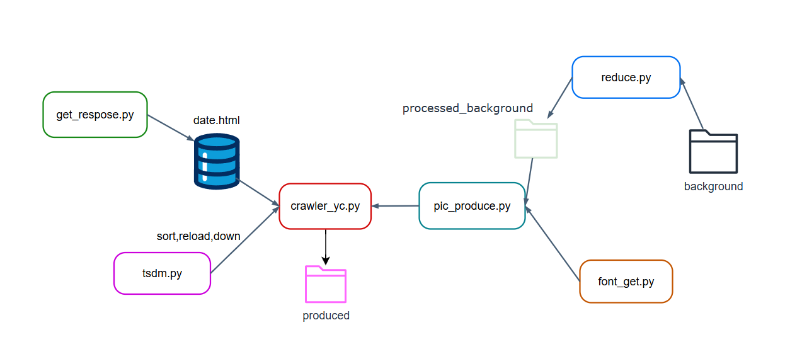
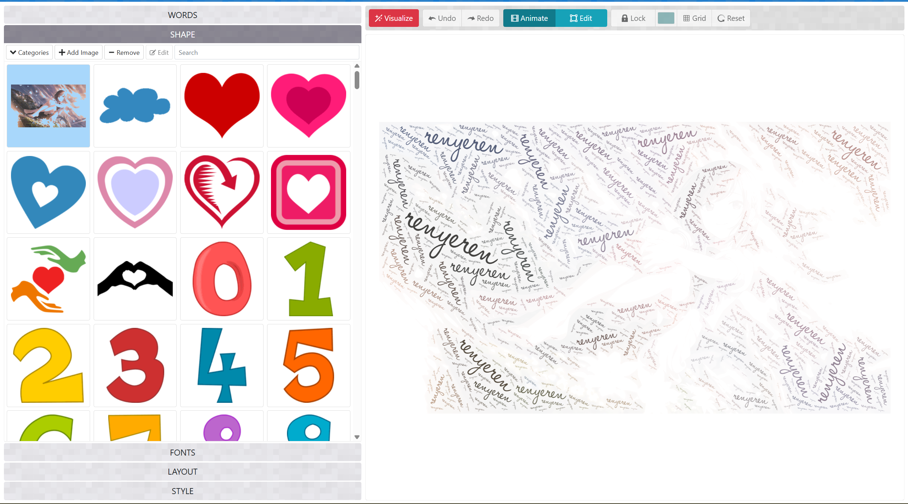
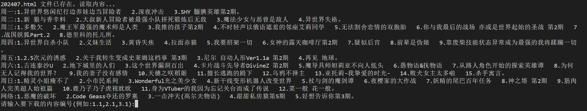
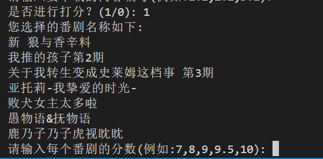
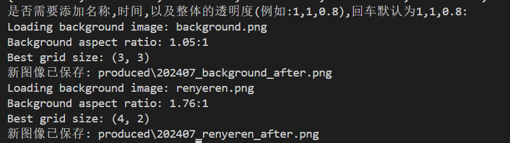

# anime_tietie
季度追番总结图生成，先来看最终生成的效果图。背景图片可以自选，可以选写自己的签名或者其他的纯洁图片，番剧可以选择加或者不加名称和更新日期，看完了之后还可以打分(十分制)，分数生成于番剧名后面。图片和文字的透明度可自选。

### 整体逻辑如下所示

### 背景生成

[word cloud generator](https://wordart.com/)

建议使用上面这个网站，可以选择生成的文字，字体，原始变换的图片等等。网站自带好像只支持英文。下面点**FONTS**可以上传字体，上传支持中文的字体应该就可以生成了。

但是网站生成的背景有一些边缘有明显的白框，合成后显得十分的不美观，可以下载后把图片放到**background**文件夹，然后运行**reduce.py**来去除周围的边缘白框。如果你觉得背景没问题，可以直接把背景放入**processed_background**文件夹，**reduce.py**运行后，生成的图片会自动放入**processed_background**文件夹。

**注：运行的时候，所有在processed_background文件夹内的图片都会拼接生成一幅最终的图像。**

### 字体选择

**字体修改**：字体选择是 font_path_text = "C:/Windows/Fonts/msyhbd.ttc"。微软雅黑，由于只有windows设备，不太清楚**其他操作系统的字体的设置路径**，其他操作系统直接运行的话大概率运行会报错，建议修改字体路径再运行。只在此处说明windows如何修改字体，在windows安装你需要的字体后，运行**font_get.py**，复制下面你需要字体的路径，修改到**pic_produce.py**第**91**行的**font_path_text**处。

**字体大小设置**：修改**pic_produce.py**第**93**行**font = ImageFont.truetype(font_path_text, 30)**中**30**的大小。

### 运行过程

准备好背景和字体之后，就可以准备运行**crawler_yc.py**了

特别说明的是，**url = 'https://yuc.wiki'**。我爬取了上诉网页来确定新番的内容，图片和更新时间。并且使用**get_respose.py**将文件保存在**html**文件中，防止反复运行或者多人运行，导致网站服务器压力过大。所以需要修改的地方也就是url中的地址，一般需要你手动修改到你需要爬取的季度新番url地址(**crawler_yc.py文件内第114行**)。或者我更新爬取好了，不需要修改也是ok的。

运行后根据操作提示输入即可。

#### 第一步

输入需要tietie的番剧。格式为1.1,2.1(**英文输入法下的逗号**)。代表星期一的1.内容和星期二的1.内容。其余类似，望楼内容输入8.1···。

**注：如果多次运行，可以直接输入回车，因为后面读取图片是直接从文件夹内读取，你的输入只负责本次下载的内容。但是最终tietie的内容是文件夹下全部图片，所以不小心下错了也请手动删除**

#### 第二步

是否进行打分？(1/0): 

输入1进行打分，0不进行打分。输入1示例：

顺序进行打分。格式为8,8,8,8(**英文输入法下的逗号**)。

#### 第三步

是否需要添加名称,时间,以及整体的透明度，格式见示例(1表示添加。0表示不添加。0.8表示80%的透明度)，这里我直接回车默认了。

### 附加说明

- **所有下载环节，如果检测到文件夹内有同名文件则不会重复下载或者生成。如果修改参数，请删除或重命名原文件。**
- **选择打分会添加\_after后缀，不打分会添加\_before后缀。两者生产的文件互不影响。**

### To do list：

暂无
